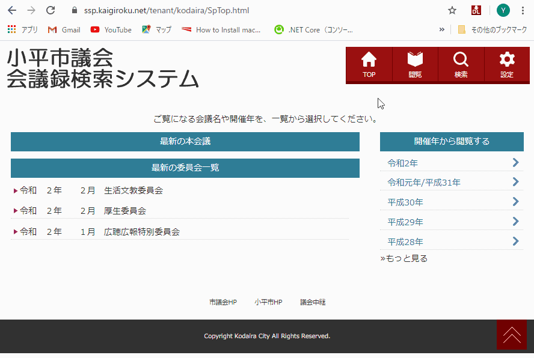

Discuss2File
====

Discuss2Fileは会議録検索システムDiscuss（NTTアドバンステクノロジ株式会社）が提供する会議録文書を、HTML形式もしくはPDF形式ファイルで一括ダウンロードするための Google Crome 拡張機能です。PDF形式ファイルへの保存は Google Chrome の印刷機能を使用します。当拡張機能はNTTアドバンステクノロジが開発しているものではありません。

## 特徴

* **HTML/PDFに保存：** 会議録内容をHTMLファイルもしくはPDFファイルに保存します 

* **一括ダウンロード：** 複数日程の会議録を一括ダウンロード可能（サーバーへ負荷をかけない設計）

* **多彩な表現：** 強調表示、カラー表示、不要部分の省略・削除など、文書の多彩な表現が可能 

* **目次の自動作成：** 置換文字列で&lt;h1&gt;～&lt;h6&gt;タグを文書中に含ませることにより、自動的に目次を作成  

* **自由なフォント：** 正規表現を書かなくとも、デフォルトで複数のフォントを選択可能 

* **高セキュリティ：** DOMレベルでのXSS対策済み

## 要件等

現在Google Chromeブラウザのみ動作確認しています。小平市の会議録を中心にテストしておりますので、他自治体では不具合が出る可能性があります。バグがありましたらIssuesにご投稿ください。

## 使い方

<table><tr><td>
 
</td></tr></table>

詳細は[こちらのサイト](https://yasutakeyohei.com/discuss2file)をご覧ください。
1. [chromeウェブストア](https://chrome.google.com/webstore/detail/%E5%9C%B0%E6%96%B9%E8%AD%B0%E4%BC%9A%E4%BC%9A%E8%AD%B0%E9%8C%B2%E3%83%80%E3%82%A6%E3%83%B3%E3%83%AD%E3%83%BC%E3%83%80%E3%83%BC%EF%BC%88discuss2fi/aooaeblcjhpdpcfaadmdglclkffefoom?authuser=0&hl=ja)からインストール
2. Discussを利用している会議録サイト（レスポンシブ対応版）にアクセスしてください
3. ブラウザ右上に表示されるDLのアイコンをクリックします
4. 必要に応じ、フォント設定・正規表現設定をそれぞれのタブで行います。
小平市の場合は設定が用意されています。正規表現設定タブで読み込みボタンを押して設定を読み込んでください
5. ダウンロードタブで必要に応じて会議を選択します
6. 「印刷画面を開く（PDF保存）」もしくは「ファイルに保存（HTML）」を選びます
7. ファイル名は通常自動作成されます。任意のファイル名も入力可能です
8. 『Downloadボタン』を押すとファイルがダウンロードされます
9. ダウンロード中は別の画面を開かないようにしてください
10. ダウンロードされたファイルはダウンロードフォルダに保存されています

## Discussについて

『会議録検索システムDiscussNetPremium』はNTTアドバンステクノロジ株式会社の登録商標です。
当拡張機能はNTTアドバンステクノロジ株式会社が製作したものではありません。小平市が製作したものでもありません。[ご質問等はこちらへ](https://yasutakeyohei.com/#contact)。

## 免責事項

* 本拡張機能を使用したことによる一切の損害について開発者は責任を負いません。

## ライセンス

[MIT](/LICENSE)

## 作者

[yasutakeyohei(github)](https://github.com/yasutakeyohei)  
[安竹洋平(小平市議)](https://yasutakeyohei.com)