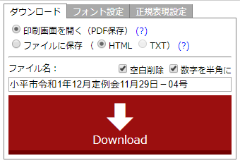

Discuss2File
====

Discuss2Fileは『議会情報公開サービスDiscussシリーズ』（NTTアドバンステクノロジ（株））の議事録情報をHTML形式もしくはPDF形式ファイルでダウンロードするための Google Crome 拡張機能です。PDF形式ファイルへの保存は Google Chrome の印刷機能を使用します。

## 特徴

* **各自治体の様式に柔軟に対応** 文書内を任意の正規表現で検索し、任意の文字列に置き換えられます。置き換え文字列にCSSスタイルやCSSクラスを記述することにより多彩な表現が可能になります。

* **目次自動作成** 置き換え文字列に&lt;h1&gt;タグから&lt;h6&gt;タグを指定することで、文書の先頭に「目次」を自動作成します。

* **一括ダウンロード** 日程が複数ある議事録をまとめて一括ダウンロードできます（サーバーへの負荷を考慮し、項目数・ダウンロード間隔に制限を設けています）。

* **高セキュリティ** DOMレベルでのXSS対策済み。

## 説明

## Requirement

現在この拡張機能は Google Chrome ブラウザのみで動作確認しています。

## Usage

<a href="https://chrome.google.com/webstore/category/extensions?hl=ja">chromeウェブストア</a> にアクセスし「Discuss2File」で検索。インストールを行ってください。

<table><tr><th>北海道</th></tr><tr><td><a href='https://ssp.kaigiroku.net/tenant/hakodate/SpTop.html'>函館市</a>
<a href='https://ssp.kaigiroku.net/tenant/asahikawa/SpTop.html'>旭川市</a>
<a href='https://ssp.kaigiroku.net/tenant/muroran/SpTop.html'>室蘭市</a>
<a href='https://ssp.kaigiroku.net/tenant/kushiro/SpTop.html'>釧路市</a>
<a href='https://ssp.kaigiroku.net/tenant/obihiro/SpTop.html'>帯広市</a>
<a href='https://ssp.kaigiroku.net/tenant/kitami/SpTop.html'>北見市</a>
<a href='https://ssp.kaigiroku.net/tenant/rumoi/SpTop.html'>留萌市</a>
<a href='https://ssp.kaigiroku.net/tenant/tomakomai/SpTop.html'>苫小牧市</a>
<a href='https://ssp.kaigiroku.net/tenant/wakkanai/SpTop.html'>稚内市</a>
<a href='https://ssp.kaigiroku.net/tenant/ashibetsu/SpTop.html'>芦別市</a>
<a href='https://ssp.kaigiroku.net/tenant/nemuro/SpTop.html'>根室市</a>
<a href='https://ssp.kaigiroku.net/tenant/chitose/SpTop.html'>千歳市</a>
<a href='https://ssp.kaigiroku.net/tenant/noboribetsu/SpTop.html'>登別市</a>
<a href='https://ssp.kaigiroku.net/tenant/eniwa/SpTop.html'>恵庭市</a>
<a href='https://ssp.kaigiroku.net/tenant/date/SpTop.html'>伊達市</a>
<a href='https://ssp.kaigiroku.net/tenant/kitahiroshima/SpTop.html'>北広島市</a>
<a href='https://ssp.kaigiroku.net/tenant/ishikari/SpTop.html'>石狩市</a>
<a href='https://ssp.kaigiroku.net/tenant/hokuto/SpTop.html'>北斗市</a>
<a href='https://ssp.kaigiroku.net/tenant/kutchan/SpTop.html'>倶知安町</a>
<a href='https://ssp.kaigiroku.net/tenant/atsuma/SpTop.html'>厚真町</a>
<a href='https://ssp.kaigiroku.net/tenant/hidakahokkaido/SpTop.html'>日高町</a>
<a href='https://ssp.kaigiroku.net/tenant/memuro/SpTop.html'>芽室町</a>
</td></tr><tr><th>青森県</th></tr><tr><td><a href='https://ssp.kaigiroku.net/tenant/towada/SpTop.html'>十和田市</a>
</td></tr><tr><th>岩手県</th></tr><tr><td><a href='https://ssp.kaigiroku.net/tenant/morioka/SpTop.html'>盛岡市</a>
<a href='https://ssp.kaigiroku.net/tenant/miyako/SpTop.html'>宮古市</a>
<a href='https://ssp.kaigiroku.net/tenant/ofunato/SpTop.html'>大船渡市</a>
<a href='https://ssp.kaigiroku.net/tenant/hanamaki/SpTop.html'>花巻市</a>
<a href='https://ssp.kaigiroku.net/tenant/kitakami/SpTop.html'>北上市</a>
<a href='https://ssp.kaigiroku.net/tenant/kuji/SpTop.html'>久慈市</a>
<a href='https://ssp.kaigiroku.net/tenant/rikuzentakata/SpTop.html'>陸前高田市</a>
<a href='https://ssp.kaigiroku.net/tenant/kamaishi/SpTop.html'>釜石市</a>
<a href='https://ssp.kaigiroku.net/tenant/ninohe/SpTop.html'>二戸市</a>
<a href='https://ssp.kaigiroku.net/tenant/oshu/SpTop.html'>奥州市</a>
<a href='https://ssp.kaigiroku.net/tenant/takizawa/SpTop.html'>滝沢市</a>
<a href='https://ssp.kaigiroku.net/tenant/shizukuishi/SpTop.html'>雫石町</a>
<a href='https://ssp.kaigiroku.net/tenant/shiwa/SpTop.html'>紫波町</a>
<a href='https://ssp.kaigiroku.net/tenant/kanegasaki/SpTop.html'>金ケ崎町</a>
</td></tr><tr><th>宮城県</th></tr><tr><td><a href='https://ssp.kaigiroku.net/tenant/prefmiyagi/SpTop.html'>宮城県庁</a>
<a href='https://ssp.kaigiroku.net/tenant/ishinomaki/SpTop.html'>石巻市</a>
<a href='https://ssp.kaigiroku.net/tenant/higashimatsushima/SpTop.html'>東松島市</a>
<a href='https://ssp.kaigiroku.net/tenant/oosaki/SpTop.html'>大崎市</a>
</td></tr><tr><th>秋田県</th></tr><tr><td><a href='https://ssp.kaigiroku.net/tenant/prefakita/SpTop.html'>秋田県庁</a>
<a href='https://ssp.kaigiroku.net/tenant/noshiro/SpTop.html'>能代市</a>
<a href='https://ssp.kaigiroku.net/tenant/oga/SpTop.html'>男鹿市</a>
<a href='https://ssp.kaigiroku.net/tenant/yuzawa/SpTop.html'>湯沢市</a>
<a href='https://ssp.kaigiroku.net/tenant/yurihonjo/SpTop.html'>由利本荘市</a>
<a href='https://ssp.kaigiroku.net/tenant/kitaakita/SpTop.html'>北秋田市</a>
<a href='https://ssp.kaigiroku.net/tenant/semboku/SpTop.html'>仙北市</a>
</td></tr><tr><th>山形県</th></tr><tr><td><a href='https://ssp.kaigiroku.net/tenant/prefyamagata/SpTop.html'>山形県庁</a>
<a href='https://ssp.kaigiroku.net/tenant/tsuruoka/SpTop.html'>鶴岡市</a>
<a href='https://ssp.kaigiroku.net/tenant/sakata/SpTop.html'>酒田市</a>
<a href='https://ssp.kaigiroku.net/tenant/murayama/SpTop.html'>村山市</a>
<a href='https://ssp.kaigiroku.net/tenant/tendo/SpTop.html'>天童市</a>
<a href='https://ssp.kaigiroku.net/tenant/shounai/SpTop.html'>庄内町</a>
</td></tr><tr><th>福島県</th></tr><tr><td><a href='https://ssp.kaigiroku.net/tenant/fukushima/SpTop.html'>福島県庁</a>
<a href='https://ssp.kaigiroku.net/tenant/aizuwakamatsu/SpTop.html'>会津若松市</a>
<a href='https://ssp.kaigiroku.net/tenant/koriyama/SpTop.html'>郡山市</a>
<a href='https://ssp.kaigiroku.net/tenant/iwaki/SpTop.html'>いわき市</a>
<a href='https://ssp.kaigiroku.net/tenant/shirakawa/SpTop.html'>白河市</a>
<a href='https://ssp.kaigiroku.net/tenant/soma/SpTop.html'>相馬市</a>
<a href='https://ssp.kaigiroku.net/tenant/nihonmatsu/SpTop.html'>二本松市</a>
<a href='https://ssp.kaigiroku.net/tenant/minamisoma/SpTop.html'>南相馬市</a>
<a href='https://ssp.kaigiroku.net/tenant/datecity/SpTop.html'>伊達市</a>
<a href='https://ssp.kaigiroku.net/tenant/motomiya/SpTop.html'>本宮市</a>
<a href='https://ssp.kaigiroku.net/tenant/kunimi/SpTop.html'>国見町</a>
<a href='https://ssp.kaigiroku.net/tenant/izumizaki/SpTop.html'>泉崎村</a>
<a href='https://ssp.kaigiroku.net/tenant/yabuki/SpTop.html'>矢吹町</a>
<a href='https://ssp.kaigiroku.net/tenant/tanagura/SpTop.html'>棚倉町</a>
<a href='https://ssp.kaigiroku.net/tenant/yamatsuri/SpTop.html'>矢祭町</a>
<a href='https://ssp.kaigiroku.net/tenant/hanawa/SpTop.html'>塙町</a>
<a href='https://ssp.kaigiroku.net/tenant/hirata/SpTop.html'>平田村</a>
<a href='https://ssp.kaigiroku.net/tenant/kawauchi/SpTop.html'>川内村</a>
</td></tr><tr><th>茨城県</th></tr><tr><td><a href='https://ssp.kaigiroku.net/tenant/mito/SpTop.html'>水戸市</a>
<a href='https://ssp.kaigiroku.net/tenant/tsuchiura/SpTop.html'>土浦市</a>
<a href='https://ssp.kaigiroku.net/tenant/koga/SpTop.html'>古河市</a>
<a href='https://ssp.kaigiroku.net/tenant/yuki/SpTop.html'>結城市</a>
<a href='https://ssp.kaigiroku.net/tenant/ryugasaki/SpTop.html'>龍ケ崎市</a>
<a href='https://ssp.kaigiroku.net/tenant/takahagi/SpTop.html'>高萩市</a>
<a href='https://ssp.kaigiroku.net/tenant/kitaibaraki/SpTop.html'>北茨城市</a>
<a href='https://ssp.kaigiroku.net/tenant/kashima/SpTop.html'>鹿嶋市</a>
<a href='https://ssp.kaigiroku.net/tenant/itako/SpTop.html'>潮来市</a>
<a href='https://ssp.kaigiroku.net/tenant/hitachiomiya/SpTop.html'>常陸大宮市</a>
<a href='https://ssp.kaigiroku.net/tenant/chikusei/SpTop.html'>筑西市</a>
<a href='https://ssp.kaigiroku.net/tenant/bando/SpTop.html'>坂東市</a>
<a href='https://ssp.kaigiroku.net/tenant/kasumigaura/SpTop.html'>かすみがうら市</a>
<a href='https://ssp.kaigiroku.net/tenant/kamisu/SpTop.html'>神栖市</a>
<a href='https://ssp.kaigiroku.net/tenant/namegata/SpTop.html'>行方市</a>
<a href='https://ssp.kaigiroku.net/tenant/hokota/SpTop.html'>鉾田市</a>
<a href='https://ssp.kaigiroku.net/tenant/omitama/SpTop.html'>小美玉市</a>
<a href='https://ssp.kaigiroku.net/tenant/ibaraki/SpTop.html'>茨城町</a>
<a href='https://ssp.kaigiroku.net/tenant/tokai/SpTop.html'>東海村</a>
<a href='https://ssp.kaigiroku.net/tenant/daigo/SpTop.html'>大子町</a>
<a href='https://ssp.kaigiroku.net/tenant/ashikaga/SpTop.html'>足利市</a>
<a href='https://ssp.kaigiroku.net/tenant/tochigi/SpTop.html'>栃木市</a>
<a href='https://ssp.kaigiroku.net/tenant/sano/SpTop.html'>佐野市</a>
<a href='https://ssp.kaigiroku.net/tenant/nikko/SpTop.html'>日光市</a>
<a href='https://ssp.kaigiroku.net/tenant/oyama/SpTop.html'>小山市</a>
<a href='https://ssp.kaigiroku.net/tenant/moka/SpTop.html'>真岡市</a>
<a href='https://ssp.kaigiroku.net/tenant/ohtawara/SpTop.html'>大田原市</a>
<a href='https://ssp.kaigiroku.net/tenant/yaita/SpTop.html'>矢板市</a>
<a href='https://ssp.kaigiroku.net/tenant/nasushiobara/SpTop.html'>那須塩原市</a>
<a href='https://ssp.kaigiroku.net/tenant/sakura/SpTop.html'>さくら市</a>
<a href='https://ssp.kaigiroku.net/tenant/shimotsuke/SpTop.html'>下野市</a>
<a href='https://ssp.kaigiroku.net/tenant/mashiko/SpTop.html'>益子町</a>
<a href='https://ssp.kaigiroku.net/tenant/ichikai/SpTop.html'>市貝町</a>
<a href='https://ssp.kaigiroku.net/tenant/haga/SpTop.html'>芳賀町</a>
<a href='https://ssp.kaigiroku.net/tenant/mibu/SpTop.html'>壬生町</a>
<a href='https://ssp.kaigiroku.net/tenant/nogi/SpTop.html'>野木町</a>
<a href='https://ssp.kaigiroku.net/tenant/shioya/SpTop.html'>塩谷町</a>
<a href='https://ssp.kaigiroku.net/tenant/takanezawa/SpTop.html'>高根沢町</a>
<a href='https://ssp.kaigiroku.net/tenant/nasu/SpTop.html'>那須町</a>
</td></tr><tr><th>群馬県</th></tr><tr><td><a href='https://ssp.kaigiroku.net/tenant/kiryu/SpTop.html'>桐生市</a>
<a href='https://ssp.kaigiroku.net/tenant/tatebayashi/SpTop.html'>館林市</a>
<a href='https://ssp.kaigiroku.net/tenant/shibukawa/SpTop.html'>渋川市</a>
<a href='https://ssp.kaigiroku.net/tenant/tomioka/SpTop.html'>富岡市</a>
<a href='https://ssp.kaigiroku.net/tenant/annaka/SpTop.html'>安中市</a>
<a href='https://ssp.kaigiroku.net/tenant/midori/SpTop.html'>みどり市</a>
<a href='https://ssp.kaigiroku.net/tenant/oizumi/SpTop.html'>大泉町</a>
</td></tr><tr><th>埼玉県</th></tr><tr><td><a href='https://ssp.kaigiroku.net/tenant/prefsaitama/SpTop.html'>埼玉県庁</a>
<a href='https://ssp.kaigiroku.net/tenant/saitama/SpTop.html'>さいたま市</a>
<a href='https://ssp.kaigiroku.net/tenant/kumagaya/SpTop.html'>熊谷市</a>
<a href='https://ssp.kaigiroku.net/tenant/kawaguchi/SpTop.html'>川口市</a>
<a href='https://ssp.kaigiroku.net/tenant/gyoda/SpTop.html'>行田市</a>
<a href='https://ssp.kaigiroku.net/tenant/chichibu/SpTop.html'>秩父市</a>
<a href='https://ssp.kaigiroku.net/tenant/tokorozawa/SpTop.html'>所沢市</a>
<a href='https://ssp.kaigiroku.net/tenant/hanno/SpTop.html'>飯能市</a>
<a href='https://ssp.kaigiroku.net/tenant/kazo/SpTop.html'>加須市</a>
<a href='https://ssp.kaigiroku.net/tenant/honjo/SpTop.html'>本庄市</a>
<a href='https://ssp.kaigiroku.net/tenant/higashimatsuyama/SpTop.html'>東松山市</a>
<a href='https://ssp.kaigiroku.net/tenant/hanyu/SpTop.html'>羽生市</a>
<a href='https://ssp.kaigiroku.net/tenant/kounosu/SpTop.html'>鴻巣市</a>
<a href='https://ssp.kaigiroku.net/tenant/fukaya/SpTop.html'>深谷市</a>
<a href='https://ssp.kaigiroku.net/tenant/ageo/SpTop.html'>上尾市</a>
<a href='https://ssp.kaigiroku.net/tenant/koshigaya/SpTop.html'>越谷市</a>
<a href='https://ssp.kaigiroku.net/tenant/asaka/SpTop.html'>朝霞市</a>
<a href='https://ssp.kaigiroku.net/tenant/shiki/SpTop.html'>志木市</a>
<a href='https://ssp.kaigiroku.net/tenant/wako/SpTop.html'>和光市</a>
<a href='https://ssp.kaigiroku.net/tenant/okegawa/SpTop.html'>桶川市</a>
<a href='https://ssp.kaigiroku.net/tenant/kuki/SpTop.html'>久喜市</a>
<a href='https://ssp.kaigiroku.net/tenant/kitamoto/SpTop.html'>北本市</a>
<a href='https://ssp.kaigiroku.net/tenant/yashio/SpTop.html'>八潮市</a>
<a href='https://ssp.kaigiroku.net/tenant/fujimi/SpTop.html'>富士見市</a>
<a href='https://ssp.kaigiroku.net/tenant/misato/SpTop.html'>三郷市</a>
<a href='https://ssp.kaigiroku.net/tenant/hasuda/SpTop.html'>蓮田市</a>
<a href='https://ssp.kaigiroku.net/tenant/sakado/SpTop.html'>坂戸市</a>
<a href='https://ssp.kaigiroku.net/tenant/satte/SpTop.html'>幸手市</a>
<a href='https://ssp.kaigiroku.net/tenant/tsurugashima/SpTop.html'>鶴ヶ島市</a>
<a href='https://ssp.kaigiroku.net/tenant/saihidaka/SpTop.html'>日高市</a>
<a href='https://ssp.kaigiroku.net/tenant/yoshikawa/SpTop.html'>吉川市</a>
<a href='https://ssp.kaigiroku.net/tenant/fujimino/SpTop.html'>ふじみ野市</a>
<a href='https://ssp.kaigiroku.net/tenant/shiraoka/SpTop.html'>白岡市</a>
<a href='https://ssp.kaigiroku.net/tenant/ina/SpTop.html'>伊奈町</a>
<a href='https://ssp.kaigiroku.net/tenant/miyoshi/SpTop.html'>三芳町</a>
<a href='https://ssp.kaigiroku.net/tenant/moroyama/SpTop.html'>毛呂山町</a>
<a href='https://ssp.kaigiroku.net/tenant/ogose/SpTop.html'>越生町</a>
<a href='https://ssp.kaigiroku.net/tenant/ogawa/SpTop.html'>小川町</a>
<a href='https://ssp.kaigiroku.net/tenant/kawajima/SpTop.html'>川島町</a>
<a href='https://ssp.kaigiroku.net/tenant/yoshimi/SpTop.html'>吉見町</a>
<a href='https://ssp.kaigiroku.net/tenant/hatoyama/SpTop.html'>鳩山町</a>
<a href='https://ssp.kaigiroku.net/tenant/higashichichibu/SpTop.html'>東秩父村</a>
<a href='https://ssp.kaigiroku.net/tenant/saimisato/SpTop.html'>美里町</a>
<a href='https://ssp.kaigiroku.net/tenant/kamikawa/SpTop.html'>神川町</a>
<a href='https://ssp.kaigiroku.net/tenant/yorii/SpTop.html'>寄居町</a>
<a href='https://ssp.kaigiroku.net/tenant/miyashiro/SpTop.html'>宮代町</a>
<a href='https://ssp.kaigiroku.net/tenant/sugito/SpTop.html'>杉戸町</a>
</td></tr><tr><th>千葉県</th></tr><tr><td><a href='https://ssp.kaigiroku.net/tenant/choshi/SpTop.html'>銚子市</a>
<a href='https://ssp.kaigiroku.net/tenant/tateyama/SpTop.html'>館山市</a>
<a href='https://ssp.kaigiroku.net/tenant/matsudo/SpTop.html'>松戸市</a>
<a href='https://ssp.kaigiroku.net/tenant/noda/SpTop.html'>野田市</a>
<a href='https://ssp.kaigiroku.net/tenant/narita/SpTop.html'>成田市</a>
<a href='https://ssp.kaigiroku.net/tenant/togane/SpTop.html'>東金市</a>
<a href='https://ssp.kaigiroku.net/tenant/narashino/SpTop.html'>習志野市</a>
<a href='https://ssp.kaigiroku.net/tenant/kashiwa/SpTop.html'>柏市</a>
<a href='https://ssp.kaigiroku.net/tenant/ichihara/SpTop.html'>市原市</a>
<a href='https://ssp.kaigiroku.net/tenant/nagareyama/SpTop.html'>流山市</a>
<a href='https://ssp.kaigiroku.net/tenant/yachiyo/SpTop.html'>八千代市</a>
<a href='https://ssp.kaigiroku.net/tenant/abiko/SpTop.html'>我孫子市</a>
<a href='https://ssp.kaigiroku.net/tenant/kamagaya/SpTop.html'>鎌ケ谷市</a>
<a href='https://ssp.kaigiroku.net/tenant/kimitsu/SpTop.html'>君津市</a>
<a href='https://ssp.kaigiroku.net/tenant/urayasu/SpTop.html'>浦安市</a>
<a href='https://ssp.kaigiroku.net/tenant/yotsukaido/SpTop.html'>四街道市</a>
<a href='https://ssp.kaigiroku.net/tenant/sodegaura/SpTop.html'>袖ケ浦市</a>
<a href='https://ssp.kaigiroku.net/tenant/inzai/SpTop.html'>印西市</a>
<a href='https://ssp.kaigiroku.net/tenant/tomisato/SpTop.html'>富里市</a>
<a href='https://ssp.kaigiroku.net/tenant/sosa/SpTop.html'>匝瑳市</a>
<a href='https://ssp.kaigiroku.net/tenant/katori/SpTop.html'>香取市</a>
<a href='https://ssp.kaigiroku.net/tenant/isumi/SpTop.html'>いすみ市</a>
<a href='https://ssp.kaigiroku.net/tenant/oamishirasato/SpTop.html'>大網白里市</a>
<a href='https://ssp.kaigiroku.net/tenant/shisui/SpTop.html'>酒々井町</a>
<a href='https://ssp.kaigiroku.net/tenant/kujukuri/SpTop.html'>九十九里町</a>
<a href='https://ssp.kaigiroku.net/tenant/shibayama/SpTop.html'>芝山町</a>
</td></tr><tr><th>東京都</th></tr><tr><td><a href='https://ssp.kaigiroku.net/tenant/shinjuku/SpTop.html'>新宿区</a>
<a href='https://ssp.kaigiroku.net/tenant/sumida/SpTop.html'>墨田区</a>
<a href='https://ssp.kaigiroku.net/tenant/shibuya/SpTop.html'>渋谷区</a>
<a href='https://ssp.kaigiroku.net/tenant/kita/SpTop.html'>北区</a>
<a href='https://ssp.kaigiroku.net/tenant/arakawa/SpTop.html'>荒川区</a>
<a href='https://ssp.kaigiroku.net/tenant/nerima/SpTop.html'>練馬区</a>
<a href='https://ssp.kaigiroku.net/tenant/tachikawa/SpTop.html'>立川市</a>
<a href='https://ssp.kaigiroku.net/tenant/ome/SpTop.html'>青梅市</a>
<a href='https://ssp.kaigiroku.net/tenant/akishima/SpTop.html'>昭島市</a>
<a href='https://ssp.kaigiroku.net/tenant/kodaira/SpTop.html'>小平市</a>
<a href='https://ssp.kaigiroku.net/tenant/kiyose/SpTop.html'>清瀬市</a>
<a href='https://ssp.kaigiroku.net/tenant/musashimurayama/SpTop.html'>武蔵村山市</a>
<a href='https://ssp.kaigiroku.net/tenant/mizuho/SpTop.html'>瑞穂町</a>
<a href='https://ssp.kaigiroku.net/tenant/ogasawara/SpTop.html'>小笠原村</a>
</td></tr><tr><th>神奈川県</th></tr><tr><td><a href='https://ssp.kaigiroku.net/tenant/prefkanagawa/SpTop.html'>神奈川県庁</a>
<a href='https://ssp.kaigiroku.net/tenant/yokohama/SpTop.html'>横浜市</a>
<a href='https://ssp.kaigiroku.net/tenant/sagamihara/SpTop.html'>相模原市</a>
<a href='https://ssp.kaigiroku.net/tenant/yokosuka/SpTop.html'>横須賀市</a>
<a href='https://ssp.kaigiroku.net/tenant/odawara/SpTop.html'>小田原市</a>
<a href='https://ssp.kaigiroku.net/tenant/zushi/SpTop.html'>逗子市</a>
<a href='https://ssp.kaigiroku.net/tenant/ayase/SpTop.html'>綾瀬市</a>
<a href='https://ssp.kaigiroku.net/tenant/aikawa/SpTop.html'>愛川町</a>
</td></tr><tr><th>新潟県</th></tr><tr><td><a href='https://ssp.kaigiroku.net/tenant/prefniigata/SpTop.html'>新潟県庁</a>
<a href='https://ssp.kaigiroku.net/tenant/ojiya/SpTop.html'>小千谷市</a>
<a href='https://ssp.kaigiroku.net/tenant/tokamachi/SpTop.html'>十日町市</a>
<a href='https://ssp.kaigiroku.net/tenant/tokamachi/SpTop.html'>見附市</a>
<a href='https://ssp.kaigiroku.net/tenant/tsubame/SpTop.html'>燕市</a>
<a href='https://ssp.kaigiroku.net/tenant/myoko/SpTop.html'>妙高市</a>
<a href='https://ssp.kaigiroku.net/tenant/gosen/SpTop.html'>五泉市</a>
<a href='https://ssp.kaigiroku.net/tenant/joetsu/SpTop.html'>上越市</a>
<a href='https://ssp.kaigiroku.net/tenant/tainai/SpTop.html'>胎内市</a>
<a href='https://ssp.kaigiroku.net/tenant/aga/SpTop.html'>阿賀町</a>
<a href='https://ssp.kaigiroku.net/tenant/oyabe/SpTop.html'>小矢部市</a>
<a href='https://ssp.kaigiroku.net/tenant/nanto/SpTop.html'>南砺市</a>
<a href='https://ssp.kaigiroku.net/tenant/imizu/SpTop.html'>射水市</a>
</td></tr><tr><th>石川県</th></tr><tr><td><a href='https://ssp.kaigiroku.net/tenant/kanazawa/SpTop.html'>金沢市</a>
<a href='https://ssp.kaigiroku.net/tenant/nanao/SpTop.html'>七尾市</a>
<a href='https://ssp.kaigiroku.net/tenant/wajima/SpTop.html'>輪島市</a>
<a href='https://ssp.kaigiroku.net/tenant/kaga/SpTop.html'>加賀市</a>
<a href='https://ssp.kaigiroku.net/tenant/hakusan/SpTop.html'>白山市</a>
<a href='https://ssp.kaigiroku.net/tenant/nonoichi/SpTop.html'>野々市市</a>
</td></tr><tr><th>福井県</th></tr><tr><td><a href='https://ssp.kaigiroku.net/tenant/fukui/SpTop.html'>福井市</a>
<a href='https://ssp.kaigiroku.net/tenant/obama/SpTop.html'>小浜市</a>
<a href='https://ssp.kaigiroku.net/tenant/ono/SpTop.html'>大野市</a>
<a href='https://ssp.kaigiroku.net/tenant/echizen/SpTop.html'>越前市</a>
<a href='https://ssp.kaigiroku.net/tenant/ohi/SpTop.html'>おおい町</a>
</td></tr><tr><th>山梨県</th></tr><tr><td><a href='https://ssp.kaigiroku.net/tenant/fujiyoshida/SpTop.html'>富士吉田市</a>
<a href='https://ssp.kaigiroku.net/tenant/tsuru/SpTop.html'>都留市</a>
<a href='https://ssp.kaigiroku.net/tenant/yamanashi/SpTop.html'>山梨市</a>
<a href='https://ssp.kaigiroku.net/tenant/otsuki/SpTop.html'>大月市</a>
<a href='https://ssp.kaigiroku.net/tenant/nirasaki/SpTop.html'>韮崎市</a>
<a href='https://ssp.kaigiroku.net/tenant/kai/SpTop.html'>甲斐市</a>
<a href='https://ssp.kaigiroku.net/tenant/uenohara/SpTop.html'>上野原市</a>
<a href='https://ssp.kaigiroku.net/tenant/koshu/SpTop.html'>甲州市</a>
<a href='https://ssp.kaigiroku.net/tenant/chuo/SpTop.html'>中央市</a>
<a href='https://ssp.kaigiroku.net/tenant/ichikawamisato/SpTop.html'>市川三郷町</a>
<a href='https://ssp.kaigiroku.net/tenant/showa/SpTop.html'>昭和町</a>
<a href='https://ssp.kaigiroku.net/tenant/fujikawaguchiko/SpTop.html'>富士河口湖町</a>
</td></tr><tr><th>長野県</th></tr><tr><td><a href='https://ssp.kaigiroku.net/tenant/nagano/SpTop.html'>長野市</a>
<a href='https://ssp.kaigiroku.net/tenant/matsumoto/SpTop.html'>松本市</a>
<a href='https://ssp.kaigiroku.net/tenant/ueda/SpTop.html'>上田市</a>
<a href='https://ssp.kaigiroku.net/tenant/okaya/SpTop.html'>岡谷市</a>
<a href='https://ssp.kaigiroku.net/tenant/iida/SpTop.html'>飯田市</a>
<a href='https://ssp.kaigiroku.net/tenant/suzaka/SpTop.html'>須坂市</a>
<a href='https://ssp.kaigiroku.net/tenant/komoro/SpTop.html'>小諸市</a>
<a href='https://ssp.kaigiroku.net/tenant/ina/SpTop.html'>伊那市</a>
<a href='https://ssp.kaigiroku.net/tenant/komagane/SpTop.html'>駒ヶ根市</a>
<a href='https://ssp.kaigiroku.net/tenant/nakano/SpTop.html'>中野市</a>
<a href='https://ssp.kaigiroku.net/tenant/omachi/SpTop.html'>大町市</a>
<a href='https://ssp.kaigiroku.net/tenant/iiyama/SpTop.html'>飯山市</a>
<a href='https://ssp.kaigiroku.net/tenant/chino/SpTop.html'>茅野市</a>
<a href='https://ssp.kaigiroku.net/tenant/shiojiri/SpTop.html'>塩尻市</a>
<a href='https://ssp.kaigiroku.net/tenant/saku/SpTop.html'>佐久市</a>
<a href='https://ssp.kaigiroku.net/tenant/chikuma/SpTop.html'>千曲市</a>
<a href='https://ssp.kaigiroku.net/tenant/tomi/SpTop.html'>東御市</a>
<a href='https://ssp.kaigiroku.net/tenant/azumino/SpTop.html'>安曇野市</a>
<a href='https://ssp.kaigiroku.net/tenant/sakuho/SpTop.html'>佐久穂町</a>
<a href='https://ssp.kaigiroku.net/tenant/karuizawa/SpTop.html'>軽井沢町</a>
<a href='https://ssp.kaigiroku.net/tenant/minowa/SpTop.html'>箕輪町</a>
</td></tr><tr><th>岐阜県</th></tr><tr><td><a href='https://ssp.kaigiroku.net/tenant/prefgifu/SpTop.html'>岐阜県庁</a>
<a href='https://ssp.kaigiroku.net/tenant/takayama/SpTop.html'>高山市</a>
<a href='https://ssp.kaigiroku.net/tenant/tajimi/SpTop.html'>多治見市</a>
<a href='https://ssp.kaigiroku.net/tenant/seki/SpTop.html'>関市</a>
<a href='https://ssp.kaigiroku.net/tenant/nakatsugawa/SpTop.html'>中津川市</a>
<a href='https://ssp.kaigiroku.net/tenant/hashima/SpTop.html'>羽島市</a>
<a href='https://ssp.kaigiroku.net/tenant/minokamo/SpTop.html'>美濃加茂市</a>
<a href='https://ssp.kaigiroku.net/tenant/toki/SpTop.html'>土岐市</a>
<a href='https://ssp.kaigiroku.net/tenant/hamamatsu/SpTop.html'>浜松市</a>
<a href='https://ssp.kaigiroku.net/tenant/atami/SpTop.html'>熱海市</a>
<a href='https://ssp.kaigiroku.net/tenant/mishima/SpTop.html'>三島市</a>
<a href='https://ssp.kaigiroku.net/tenant/fujinomiya/SpTop.html'>富士宮市</a>
<a href='https://ssp.kaigiroku.net/tenant/iwata/SpTop.html'>磐田市</a>
<a href='https://ssp.kaigiroku.net/tenant/susono/SpTop.html'>裾野市</a>
<a href='https://ssp.kaigiroku.net/tenant/omaezaki/SpTop.html'>御前崎市</a>
<a href='https://ssp.kaigiroku.net/tenant/kikugawa/SpTop.html'>菊川市</a>
<a href='https://ssp.kaigiroku.net/tenant/izunokuni/SpTop.html'>伊豆の国市</a>
<a href='https://ssp.kaigiroku.net/tenant/kannami/SpTop.html'>函南町</a>
</td></tr><tr><th>愛知県</th></tr><tr><td><a href='https://ssp.kaigiroku.net/tenant/nagoya/SpTop.html'>名古屋市</a>
<a href='https://ssp.kaigiroku.net/tenant/toyohashi/SpTop.html'>豊橋市</a>
<a href='https://ssp.kaigiroku.net/tenant/okazaki/SpTop.html'>岡崎市</a>
<a href='https://ssp.kaigiroku.net/tenant/ichinomiya/SpTop.html'>一宮市</a>
<a href='https://ssp.kaigiroku.net/tenant/seto/SpTop.html'>瀬戸市</a>
<a href='https://ssp.kaigiroku.net/tenant/handa/SpTop.html'>半田市</a>
<a href='https://ssp.kaigiroku.net/tenant/kasugai/SpTop.html'>春日井市</a>
<a href='https://ssp.kaigiroku.net/tenant/toyokawa/SpTop.html'>豊川市</a>
<a href='https://ssp.kaigiroku.net/tenant/kariya/SpTop.html'>刈谷市</a>
<a href='https://ssp.kaigiroku.net/tenant/anjo/SpTop.html'>安城市</a>
<a href='https://ssp.kaigiroku.net/tenant/gamagori/SpTop.html'>蒲郡市</a>
<a href='https://ssp.kaigiroku.net/tenant/tokoname/SpTop.html'>常滑市</a>
<a href='https://ssp.kaigiroku.net/tenant/kounan/SpTop.html'>江南市</a>
<a href='https://ssp.kaigiroku.net/tenant/chita/SpTop.html'>知多市</a>
<a href='https://ssp.kaigiroku.net/tenant/owariasahi/SpTop.html'>尾張旭市</a>
<a href='https://ssp.kaigiroku.net/tenant/nisshin/SpTop.html'>日進市</a>
<a href='https://ssp.kaigiroku.net/tenant/tahara/SpTop.html'>田原市</a>
<a href='https://ssp.kaigiroku.net/tenant/kitanagoya/SpTop.html'>北名古屋市</a>
<a href='https://ssp.kaigiroku.net/tenant/toyoyama/SpTop.html'>豊山町</a>
<a href='https://ssp.kaigiroku.net/tenant/tobishima/SpTop.html'>飛島村</a>
<a href='https://ssp.kaigiroku.net/tenant/agui/SpTop.html'>阿久比町</a>
<a href='https://ssp.kaigiroku.net/tenant/higashiura/SpTop.html'>東浦町</a>
<a href='https://ssp.kaigiroku.net/tenant/taketoyo/SpTop.html'>武豊町</a>
</td></tr><tr><th>三重県</th></tr><tr><td><a href='https://ssp.kaigiroku.net/tenant/prefmie/SpTop.html'>三重県庁</a>
<a href='https://ssp.kaigiroku.net/tenant/tsu/SpTop.html'>津市</a>
<a href='https://ssp.kaigiroku.net/tenant/ise/SpTop.html'>伊勢市</a>
<a href='https://ssp.kaigiroku.net/tenant/matsusaka/SpTop.html'>松阪市</a>
<a href='https://ssp.kaigiroku.net/tenant/nabari/SpTop.html'>名張市</a>
<a href='https://ssp.kaigiroku.net/tenant/toba/SpTop.html'>鳥羽市</a>
<a href='https://ssp.kaigiroku.net/tenant/odai/SpTop.html'>大台町</a>
</td></tr><tr><th>滋賀県</th></tr><tr><td><a href='https://ssp.kaigiroku.net/tenant/nagahama/SpTop.html'>長浜市</a>
<a href='https://ssp.kaigiroku.net/tenant/omihachiman/SpTop.html'>近江八幡市</a>
<a href='https://ssp.kaigiroku.net/tenant/koka/SpTop.html'>甲賀市</a>
<a href='https://ssp.kaigiroku.net/tenant/konan/SpTop.html'>湖南市</a>
<a href='https://ssp.kaigiroku.net/tenant/takashima/SpTop.html'>高島市</a>
<a href='https://ssp.kaigiroku.net/tenant/kyoto/SpTop.html'>京都市（導入事例）</a>
<a href='https://ssp.kaigiroku.net/tenant/uji/SpTop.html'>宇治市</a>
<a href='https://ssp.kaigiroku.net/tenant/kameoka/SpTop.html'>亀岡市</a>
<a href='https://ssp.kaigiroku.net/tenant/kyotanabe/SpTop.html'>京田辺市</a>
<a href='https://ssp.kaigiroku.net/tenant/yosano/SpTop.html'>与謝野町</a>
</td></tr><tr><th>大阪府</th></tr><tr><td><a href='https://ssp.kaigiroku.net/tenant/prefosaka/SpTop.html'>大阪府庁</a>
<a href='https://ssp.kaigiroku.net/tenant/cityosaka/SpTop.html'>大阪市</a>
<a href='https://ssp.kaigiroku.net/tenant/suita/SpTop.html'>吹田市</a>
<a href='https://ssp.kaigiroku.net/tenant/izumiotsu/SpTop.html'>泉大津市</a>
<a href='https://ssp.kaigiroku.net/tenant/kaizuka/SpTop.html'>貝塚市</a>
<a href='https://ssp.kaigiroku.net/tenant/izumisano/SpTop.html'>泉佐野市</a>
<a href='https://ssp.kaigiroku.net/tenant/tondabayashi/SpTop.html'>富田林市</a>
<a href='https://ssp.kaigiroku.net/tenant/kawachinagano/SpTop.html'>河内長野市</a>
<a href='https://ssp.kaigiroku.net/tenant/matsubara/SpTop.html'>松原市</a>
<a href='https://ssp.kaigiroku.net/tenant/izumi/SpTop.html'>和泉市</a>
<a href='https://ssp.kaigiroku.net/tenant/minoh/SpTop.html'>箕面市</a>
<a href='https://ssp.kaigiroku.net/tenant/kashiwara/SpTop.html'>柏原市</a>
<a href='https://ssp.kaigiroku.net/tenant/settsu/SpTop.html'>摂津市</a>
<a href='https://ssp.kaigiroku.net/tenant/takaishi/SpTop.html'>高石市</a>
<a href='https://ssp.kaigiroku.net/tenant/fujiidera/SpTop.html'>藤井寺市</a>
<a href='https://ssp.kaigiroku.net/tenant/shijonawate/SpTop.html'>四條畷市</a>
<a href='https://ssp.kaigiroku.net/tenant/katano/SpTop.html'>交野市</a>
<a href='https://ssp.kaigiroku.net/tenant/osakasayama/SpTop.html'>大阪狭山市</a>
<a href='https://ssp.kaigiroku.net/tenant/hannan/SpTop.html'>阪南市</a>
<a href='https://ssp.kaigiroku.net/tenant/tadaoka/SpTop.html'>忠岡町</a>
<a href='https://ssp.kaigiroku.net/tenant/amagasaki/SpTop.html'>尼崎市</a>
<a href='https://ssp.kaigiroku.net/tenant/ashiya/SpTop.html'>芦屋市</a>
<a href='https://ssp.kaigiroku.net/tenant/miki/SpTop.html'>三木市</a>
<a href='https://ssp.kaigiroku.net/tenant/kawanishi/SpTop.html'>川西市</a>
<a href='https://ssp.kaigiroku.net/tenant/sanda/SpTop.html'>三田市</a>
<a href='https://ssp.kaigiroku.net/tenant/kasai/SpTop.html'>加西市</a>
<a href='https://ssp.kaigiroku.net/tenant/kato/SpTop.html'>加東市</a>
<a href='https://ssp.kaigiroku.net/tenant/taka/SpTop.html'>多可町</a>
</td></tr><tr><th>奈良県</th></tr><tr><td><a href='https://ssp.kaigiroku.net/tenant/prefnara/SpTop.html'>奈良県庁</a>
<a href='https://ssp.kaigiroku.net/tenant/narashi/SpTop.html'>奈良市</a>
<a href='https://ssp.kaigiroku.net/tenant/yamatokoriyama/SpTop.html'>大和郡山市</a>
<a href='https://ssp.kaigiroku.net/tenant/tenri/SpTop.html'>天理市</a>
<a href='https://ssp.kaigiroku.net/tenant/gojo/SpTop.html'>五條市</a>
<a href='https://ssp.kaigiroku.net/tenant/gose/SpTop.html'>御所市</a>
<a href='https://ssp.kaigiroku.net/tenant/kashiba/SpTop.html'>香芝市</a>
<a href='https://ssp.kaigiroku.net/tenant/oji/SpTop.html'>王寺町</a>
</td></tr><tr><th>和歌山県</th></tr><tr><td><a href='https://ssp.kaigiroku.net/tenant/wakayama/SpTop.html'>和歌山市</a>
<a href='https://ssp.kaigiroku.net/tenant/kainan/SpTop.html'>海南市</a>
<a href='https://ssp.kaigiroku.net/tenant/gobo/SpTop.html'>御坊市</a>
<a href='https://ssp.kaigiroku.net/tenant/shingu/SpTop.html'>新宮市</a>
<a href='https://ssp.kaigiroku.net/tenant/inami/SpTop.html'>印南町</a>
</td></tr><tr><th>鳥取県</th></tr><tr><td><a href='https://ssp.kaigiroku.net/tenant/iwami/SpTop.html'>岩美町</a>
</td></tr><tr><th>島根県</th></tr><tr><td><a href='https://ssp.kaigiroku.net/tenant/matsue/SpTop.html'>松江市</a>
<a href='https://ssp.kaigiroku.net/tenant/hamada/SpTop.html'>浜田市</a>
<a href='https://ssp.kaigiroku.net/tenant/masuda/SpTop.html'>益田市</a>
<a href='https://ssp.kaigiroku.net/tenant/yasugi/SpTop.html'>安来市</a>
<a href='https://ssp.kaigiroku.net/tenant/gotsu/SpTop.html'>江津市</a>
</td></tr><tr><th>岡山県</th></tr><tr><td><a href='https://ssp.kaigiroku.net/tenant/prefokayama/SpTop.html'>岡山県庁</a>
<a href='https://ssp.kaigiroku.net/tenant/okayama/SpTop.html'>岡山市</a>
<a href='https://ssp.kaigiroku.net/tenant/kurashiki/SpTop.html'>倉敷市</a>
<a href='https://ssp.kaigiroku.net/tenant/tsuyama/SpTop.html'>津山市</a>
<a href='https://ssp.kaigiroku.net/tenant/tamano/SpTop.html'>玉野市</a>
<a href='https://ssp.kaigiroku.net/tenant/kasaoka/SpTop.html'>笠岡市</a>
<a href='https://ssp.kaigiroku.net/tenant/ibara/SpTop.html'>井原市</a>
<a href='https://ssp.kaigiroku.net/tenant/soja/SpTop.html'>総社市</a>
<a href='https://ssp.kaigiroku.net/tenant/takahashi/SpTop.html'>高梁市</a>
<a href='https://ssp.kaigiroku.net/tenant/bizen/SpTop.html'>備前市</a>
<a href='https://ssp.kaigiroku.net/tenant/setouchi/SpTop.html'>瀬戸内市</a>
<a href='https://ssp.kaigiroku.net/tenant/akaiwa/SpTop.html'>赤磐市</a>
<a href='https://ssp.kaigiroku.net/tenant/maniwa/SpTop.html'>真庭市</a>
<a href='https://ssp.kaigiroku.net/tenant/asakuchi/SpTop.html'>浅口市</a>
<a href='https://ssp.kaigiroku.net/tenant/hayashima/SpTop.html'>早島町</a>
<a href='https://ssp.kaigiroku.net/tenant/satosho/SpTop.html'>里庄町</a>
<a href='https://ssp.kaigiroku.net/tenant/satosho/SpTop.html'>鏡野町</a>
<a href='https://ssp.kaigiroku.net/tenant/misaki/SpTop.html'>美咲町</a>
<a href='https://ssp.kaigiroku.net/tenant/kure/SpTop.html'>呉市</a>
<a href='https://ssp.kaigiroku.net/tenant/mihara/SpTop.html'>三原市</a>
<a href='https://ssp.kaigiroku.net/tenant/onomichi/SpTop.html'>尾道市</a>
<a href='https://ssp.kaigiroku.net/tenant/fukuyama/SpTop.html'>福山市</a>
<a href='https://ssp.kaigiroku.net/tenant/shobara/SpTop.html'>庄原市</a>
<a href='https://ssp.kaigiroku.net/tenant/higashihiroshima/SpTop.html'>東広島市</a>
<a href='https://ssp.kaigiroku.net/tenant/jinsekikougen/SpTop.html'>神石高原町</a>
</td></tr><tr><th>山口県</th></tr><tr><td><a href='https://ssp.kaigiroku.net/tenant/prefyamaguchi/SpTop.html'>山口県庁</a>
<a href='https://ssp.kaigiroku.net/tenant/shimonoseki/SpTop.html'>下関市</a>
<a href='https://ssp.kaigiroku.net/tenant/ube/SpTop.html'>宇部市</a>
<a href='https://ssp.kaigiroku.net/tenant/hagi/SpTop.html'>萩市</a>
<a href='https://ssp.kaigiroku.net/tenant/hofu/SpTop.html'>防府市</a>
<a href='https://ssp.kaigiroku.net/tenant/kudamatsu/SpTop.html'>下松市</a>
<a href='https://ssp.kaigiroku.net/tenant/iwakuni/SpTop.html'>岩国市</a>
<a href='https://ssp.kaigiroku.net/tenant/nagato/SpTop.html'>長門市</a>
<a href='https://ssp.kaigiroku.net/tenant/yanai/SpTop.html'>柳井市</a>
<a href='https://ssp.kaigiroku.net/tenant/shunan/SpTop.html'>周南市</a>
<a href='https://ssp.kaigiroku.net/tenant/sanyoonoda/SpTop.html'>山陽小野田市</a>
</td></tr><tr><th>徳島県</th></tr><tr><td><a href='https://ssp.kaigiroku.net/tenant/tokushimapref/SpTop.html'>徳島県庁</a>
<a href='https://ssp.kaigiroku.net/tenant/naruto/SpTop.html'>鳴門市</a>
<a href='https://ssp.kaigiroku.net/tenant/anan/SpTop.html'>阿南市</a>
<a href='https://ssp.kaigiroku.net/tenant/naruto/SpTop.html'>三好市</a>
<a href='https://ssp.kaigiroku.net/tenant/ishii/SpTop.html'>石井町</a>
<a href='https://ssp.kaigiroku.net/tenant/naka/SpTop.html'>那賀町</a>
<a href='https://ssp.kaigiroku.net/tenant/takamatsu/SpTop.html'>高松市</a>
<a href='https://ssp.kaigiroku.net/tenant/marugame/SpTop.html'>丸亀市</a>
<a href='https://ssp.kaigiroku.net/tenant/sakaide/SpTop.html'>坂出市</a>
<a href='https://ssp.kaigiroku.net/tenant/zentsuji/SpTop.html'>善通寺市</a>
<a href='https://ssp.kaigiroku.net/tenant/kanonji/SpTop.html'>観音寺市</a>
</td></tr><tr><th>愛媛県</th></tr><tr><td><a href='https://ssp.kaigiroku.net/tenant/matsuyama/SpTop.html'>松山市</a>
<a href='https://ssp.kaigiroku.net/tenant/uwajima/SpTop.html'>宇和島市</a>
<a href='https://ssp.kaigiroku.net/tenant/saijo/SpTop.html'>西条市</a>
<a href='https://ssp.kaigiroku.net/tenant/iyo/SpTop.html'>伊予市</a>
<a href='https://ssp.kaigiroku.net/tenant/shikokuchuo/SpTop.html'>四国中央市</a>
<a href='https://ssp.kaigiroku.net/tenant/toon/SpTop.html'>東温市</a>
</td></tr><tr><th>高知県</th></tr><tr><td><a href='https://ssp.kaigiroku.net/tenant/prefkochi/SpTop.html'>高知県庁</a>
<a href='https://ssp.kaigiroku.net/tenant/kochi/SpTop.html'>高知市</a>
<a href='https://ssp.kaigiroku.net/tenant/tosa/SpTop.html'>土佐市</a>
<a href='https://ssp.kaigiroku.net/tenant/shimanto/SpTop.html'>四万十市</a>
<a href='https://ssp.kaigiroku.net/tenant/ino/SpTop.html'>いの町</a>
</td></tr><tr><th>福岡県</th></tr><tr><td><a href='https://ssp.kaigiroku.net/tenant/kitakyushu/SpTop.html'>北九州市</a>
<a href='https://ssp.kaigiroku.net/tenant/omuta/SpTop.html'>大牟田市</a>
<a href='https://ssp.kaigiroku.net/tenant/chikugo/SpTop.html'>筑後市</a>
<a href='https://ssp.kaigiroku.net/tenant/yukuhashi/SpTop.html'>行橋市</a>
<a href='https://ssp.kaigiroku.net/tenant/ogori/SpTop.html'>小郡市</a>
<a href='https://ssp.kaigiroku.net/tenant/fukutsu/SpTop.html'>福津市</a>
<a href='https://ssp.kaigiroku.net/tenant/nakagawa/SpTop.html'>那珂川市</a>
<a href='https://ssp.kaigiroku.net/tenant/shime/SpTop.html'>志免町</a>
<a href='https://ssp.kaigiroku.net/tenant/okagaki/SpTop.html'>岡垣町</a>
<a href='https://ssp.kaigiroku.net/tenant/kanda/SpTop.html'>苅田町</a>
<a href='https://ssp.kaigiroku.net/tenant/miyako/SpTop.html'>みやこ町</a>
</td></tr><tr><th>佐賀県</th></tr><tr><td><a href='https://ssp.kaigiroku.net/tenant/karatsu/SpTop.html'>唐津市</a>
<a href='https://ssp.kaigiroku.net/tenant/tosu/SpTop.html'>鳥栖市</a>
<a href='https://ssp.kaigiroku.net/tenant/taku/SpTop.html'>多久市</a>
<a href='https://ssp.kaigiroku.net/tenant/imari/SpTop.html'>伊万里市</a>
</td></tr><tr><th>長崎県</th></tr><tr><td><a href='https://ssp.kaigiroku.net/tenant/prefnagasaki/SpTop.html'>長崎県庁</a>
<a href='https://ssp.kaigiroku.net/tenant/sasebo/SpTop.html'>佐世保市</a>
<a href='https://ssp.kaigiroku.net/tenant/omura/SpTop.html'>大村市</a>
<a href='https://ssp.kaigiroku.net/tenant/hirado/SpTop.html'>平戸市</a>
<a href='https://ssp.kaigiroku.net/tenant/tsushima/SpTop.html'>対馬市</a>
<a href='https://ssp.kaigiroku.net/tenant/goto/SpTop.html'>五島市</a>
<a href='https://ssp.kaigiroku.net/tenant/saikai/SpTop.html'>西海市</a>
<a href='https://ssp.kaigiroku.net/tenant/unzen/SpTop.html'>雲仙市</a>
<a href='https://ssp.kaigiroku.net/tenant/minamishimabara/SpTop.html'>南島原市</a>
</td></tr><tr><th>熊本県</th></tr><tr><td><a href='https://ssp.kaigiroku.net/tenant/prefkumamoto/SpTop.html'>熊本県庁</a>
<a href='https://ssp.kaigiroku.net/tenant/uto/SpTop.html'>宇土市</a>
<a href='https://ssp.kaigiroku.net/tenant/uki/SpTop.html'>宇城市</a>
<a href='https://ssp.kaigiroku.net/tenant/amakusa/SpTop.html'>天草市</a>
<a href='https://ssp.kaigiroku.net/tenant/koshi/SpTop.html'>合志市</a>
</td></tr><tr><th>大分県</th></tr><tr><td><a href='https://ssp.kaigiroku.net/tenant/prefoita/SpTop.html'>大分県庁</a>
<a href='https://ssp.kaigiroku.net/tenant/nakatsu/SpTop.html'>中津市</a>
<a href='https://ssp.kaigiroku.net/tenant/hita/SpTop.html'>日田市</a>
<a href='https://ssp.kaigiroku.net/tenant/usuki/SpTop.html'>臼杵市</a>
<a href='https://ssp.kaigiroku.net/tenant/taketa/SpTop.html'>竹田市</a>
<a href='https://ssp.kaigiroku.net/tenant/bungotakada/SpTop.html'>豊後高田市</a>
<a href='https://ssp.kaigiroku.net/tenant/kitsuki/SpTop.html'>杵築市</a>
<a href='https://ssp.kaigiroku.net/tenant/bungoohno/SpTop.html'>豊後大野市</a>
<a href='https://ssp.kaigiroku.net/tenant/kunisaki/SpTop.html'>国東市</a>
<a href='https://ssp.kaigiroku.net/tenant/kokonoe/SpTop.html'>九重町</a>
</td></tr><tr><th>宮崎県</th></tr><tr><td><a href='https://ssp.kaigiroku.net/tenant/miyazakipref/SpTop.html'>宮崎県庁</a>
<a href='https://ssp.kaigiroku.net/tenant/kobayashi/SpTop.html'>小林市</a>
<a href='https://ssp.kaigiroku.net/tenant/hyuga/SpTop.html'>日向市</a>
<a href='https://ssp.kaigiroku.net/tenant/saito/SpTop.html'>西都市</a>
<a href='https://ssp.kaigiroku.net/tenant/aya/SpTop.html'>綾町</a>
<a href='https://ssp.kaigiroku.net/tenant/shintomi/SpTop.html'>新富町</a>
<a href='https://ssp.kaigiroku.net/tenant/kadogawa/SpTop.html'>門川町</a>
</td></tr><tr><th>鹿児島県</th></tr><tr><td><a href='https://ssp.kaigiroku.net/tenant/kagoshima/SpTop.html'>鹿児島市</a>
<a href='https://ssp.kaigiroku.net/tenant/kanoya/SpTop.html'>鹿屋市</a>
<a href='https://ssp.kaigiroku.net/tenant/satsumasendai/SpTop.html'>薩摩川内市</a>
<a href='https://ssp.kaigiroku.net/tenant/minamikyushu/SpTop.html'>南九州市</a>
<a href='https://ssp.kaigiroku.net/tenant/aira/SpTop.html'>姶良市</a>
<a href='https://ssp.kaigiroku.net/tenant/kimotsuki/SpTop.html'>肝付町</a>
<a href='https://ssp.kaigiroku.net/tenant/ginowan/SpTop.html'>宜野湾市</a>
<a href='https://ssp.kaigiroku.net/tenant/ishigaki/SpTop.html'>石垣市</a>
<a href='https://ssp.kaigiroku.net/tenant/urasoe/SpTop.html'>浦添市</a>
<a href='https://ssp.kaigiroku.net/tenant/nago/SpTop.html'>名護市</a>
<a href='https://ssp.kaigiroku.net/tenant/itoman/SpTop.html'>糸満市</a>
<a href='https://ssp.kaigiroku.net/tenant/okinawa/SpTop.html'>沖縄市</a>
<a href='https://ssp.kaigiroku.net/tenant/tomigusuku/SpTop.html'>豊見城市</a>
<a href='https://ssp.kaigiroku.net/tenant/uruma/SpTop.html'>うるま市</a>
<a href='https://ssp.kaigiroku.net/tenant/miyakojima/SpTop.html'>宮古島市</a>
<a href='https://ssp.kaigiroku.net/tenant/nanjo/SpTop.html'>南城市</a>
<a href='https://ssp.kaigiroku.net/tenant/higashi/SpTop.html'>東村</a>
<a href='https://ssp.kaigiroku.net/tenant/onna/SpTop.html'>恩納村</a>
<a href='https://ssp.kaigiroku.net/tenant/ginoza/SpTop.html'>宜野座村</a>
<a href='https://ssp.kaigiroku.net/tenant/yomitan/SpTop.html'>読谷村</a>
<a href='https://ssp.kaigiroku.net/tenant/kadena/SpTop.html'>嘉手納町</a>
<a href='https://ssp.kaigiroku.net/tenant/chatan/SpTop.html'>北谷町</a>
<a href='https://ssp.kaigiroku.net/tenant/nishihara/SpTop.html'>西原町</a>
<a href='https://ssp.kaigiroku.net/tenant/yonabaru/SpTop.html'>与那原町</a>
<a href='https://ssp.kaigiroku.net/tenant/yaese/SpTop.html'>八重瀬町</a>
<a href='https://ssp.kaigiroku.net/tenant/taketomi/SpTop.html'>竹富町</a>
</td></tr></table>

## Install

## Contribution

## Licence

[MIT](https://github.com/tcnksm/tool/blob/master/LICENCE)

## Author

[tcnksm](https://github.com/tcnksm)

Discuss2Fileは、NTTアドバンステクノロジ株式会社が提供する、議会情報公開サービスDiscussの、